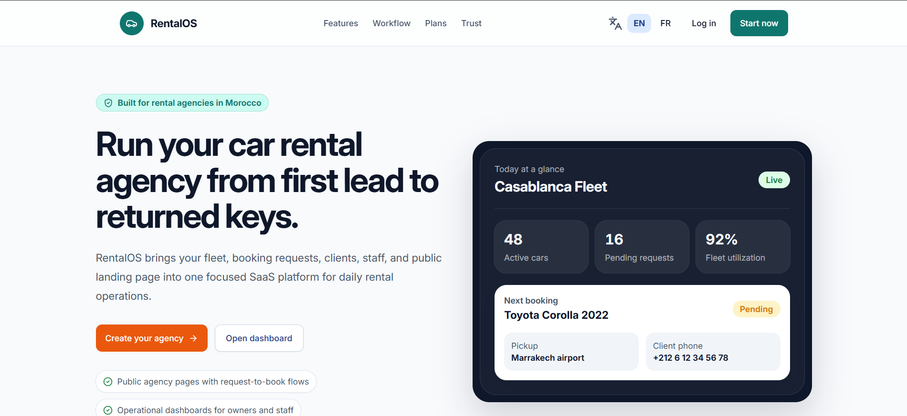

# Salaheddine Laatarsi

### Full-Stack Product Builder · AI-Assisted Developer

I build complete digital products from business requirements to production, with a focus on scalable architectures, SaaS platforms, and AI-assisted engineering workflows.

[**Portfolio**](https://salaheddine-laatarsi.vercel.app/) · [**RentalOS Demo**](https://demo-rental-os.vercel.app/) · [**LinkedIn**](https://www.linkedin.com/in/salaheddine-laatarsi) · [**Email**](mailto:laatarsisalaheddine@gmail.com)

---

## About

I am a Morocco-based full-stack developer and currently a **Senior Web Developer at Imperium Solutions**. I turn product ideas and business requirements into maintainable applications, working across architecture, interfaces, APIs, data, security, testing, and deployment. I am particularly interested in SaaS and AI-assisted software development—not as a substitute for engineering judgment, but as a way to deliver focused, well-reviewed work. My priority is building coherent products that solve real operational problems.

## What I build

| Product area | Engineering focus |
| --- | --- |
| **SaaS products** | Product workflows, operational dashboards, and production delivery |
| **Complex systems** | Business rules, permissions, integrations, performance, and maintainable architecture |
| **Multi-tenant platforms** | Tenant-aware data models, agency-level isolation, authentication, and role-based access |
| **Booking & business tools** | Availability, lifecycle management, internal workflows, and customer-facing experiences |
| **API-driven applications** | REST APIs, server functions, integrations, validation, and reliable data flows |

## Featured project — RentalOS

### RentalOS

**A multi-tenant SaaS platform for Moroccan car-rental agencies.**

Many local agencies still coordinate daily operations through WhatsApp, spreadsheets, paper documents, and disconnected tools. RentalOS brings cars, availability, customers, booking requests, reservations, staff, roles, contracts, commissions, booking statuses, and public agency booking pages into one operational product.

- **My contribution:** Product analysis, requirements, architecture, database design, full-stack implementation, security review, testing, and deployment.
- **Main technologies:** TypeScript, PostgreSQL, Prisma, Better Auth, and Vercel.
- **Architecture highlights:** Multi-tenant design, agency-level data isolation, authentication, role-based authorization, relational modelling, server-side validation, booking lifecycle management, public booking flows, and reusable components.
- **Links:** [Portfolio and technical overview](https://salaheddine-laatarsi.vercel.app/) · [Live product demo](https://demo-rental-os.vercel.app/)
- **Source availability:** RentalOS is an active product in development, and its full source code is not publicly available. A live demonstration and product walkthrough are available through the links above.

## Selected work

### Used.ma

A second-hand fashion marketplace for Morocco, with browsing, search, cart, listing, and account experiences.

- **My contribution:** Full-stack storefront and customer flows.
- **Main technologies:** Laravel and Tailwind CSS.
- **Link:** [Live site](https://used.ma/)

### Contact+

A B2B contact-management product for centralizing company records, contacts, digital business cards, and sharing.

- **My contribution:** Built the dashboard and implemented the product's business logic.
- **Main technologies:** React, Symfony, Tailwind CSS, and Bootstrap.
- **Link:** [Live site](https://contact.imperium.plus/)

### Atlas Labo

A patient-facing website for a medical analysis laboratory in Khemisset, covering services, pricing, biocalculators, and patient information.

- **My contribution:** Built the complete application from end to end.
- **Main technologies:** TanStack Start, Tailwind CSS, and shadcn/ui.
- **Link:** [Live site](https://atlaslabo.vercel.app/)

> These projects are demonstrated through live deployments and my portfolio; their source repositories are not publicly available on this GitHub account.

## How I work with AI

**Idea → Requirements → Architecture → Implementation → Review → Testing → Deployment**

1. I start with the business problem: users, journeys, rules, permissions, constraints, and edge cases.
2. I use ChatGPT to challenge assumptions, identify missing cases, structure PRDs, and prepare implementation plans with clear acceptance criteria.
3. I give Codex or Pi Agent focused tasks with the relevant files, business rules, constraints, and existing codebase conventions.
4. I inspect every generated diff, run the application, and validate functionality, permissions, loading states, errors, and edge cases.
5. I refactor where needed, document important decisions, use GitHub for version control, and deploy previews and production releases through Vercel.

> **AI accelerates my workflow, but product decisions, architecture, security, validation, code quality, and final delivery remain my responsibility.**

## Technical skills

| Category | Technologies and practices |
| --- | --- |
| **Full-Stack** | TypeScript, JavaScript, Node.js, Express, PHP, Laravel, Symfony, REST APIs, server functions |
| **Backend & architecture** | Authentication, authorization, multi-tenant architecture, system design, caching, performance optimization |
| **Database** | PostgreSQL, Prisma, Drizzle ORM, database modelling, relational schema design |
| **AI workflow** | ChatGPT, Codex, Pi Agent; requirements analysis, planning, focused implementation, diff review, and validation |
| **Tools & deployment** | Git, GitHub, Vercel, Jira, Figma, VS Code |

## Experience

| Period | Role | Scope |
| --- | --- | --- |
| **Jan 2025 – Present** | **Senior Web Developer · Imperium Solutions** | Build complex applications and dashboards, shape scalable architecture and caching strategies, collaborate across teams, review implementations, and support developers. |
| **Aug 2023 – Jan 2025** | **Web Developer · 3W Media** | Continued delivering web products across frontend and backend workflows. |
| **Dec 2020 – Aug 2023** | **Junior Full-Stack Developer · 3W Media** | Built full-stack features with TypeScript, JavaScript, PHP, Symfony, Laravel APIs, and REST APIs. |
| **Apr 2022 – May 2023** | **Full-Stack Developer · Usedigital (part-time)** | Built a multi-vendor e-commerce platform from product requirements through full-stack delivery. |
| **Aug 2019 – Feb 2020** | **Full-Stack Developer · Shiftup-IT** | Worked on complex applications, dashboards, API integrations, and full-stack web development. |
| **Project-based** | **Freelance Mobile Developer** | Built the GiveAndTake mobile application for iOS and Android with Flutter and Dart. |

## Current focus

Currently focused on building production-ready SaaS products, refining AI-assisted engineering workflows, and delivering scalable full-stack applications with **TanStack Start**.

## Connect

- **Portfolio:** [salaheddine-laatarsi.vercel.app](https://salaheddine-laatarsi.vercel.app/)
- **GitHub:** [github.com/slaatarsi](https://github.com/slaatarsi)
- **LinkedIn:** [linkedin.com/in/salaheddine-laatarsi](https://www.linkedin.com/in/salaheddine-laatarsi)
- **Email:** [laatarsisalaheddine@gmail.com](mailto:laatarsisalaheddine@gmail.com)
